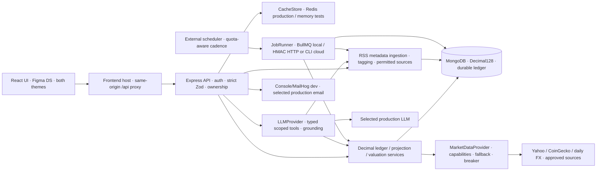
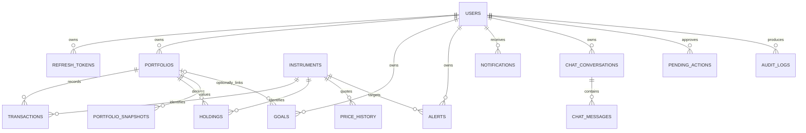
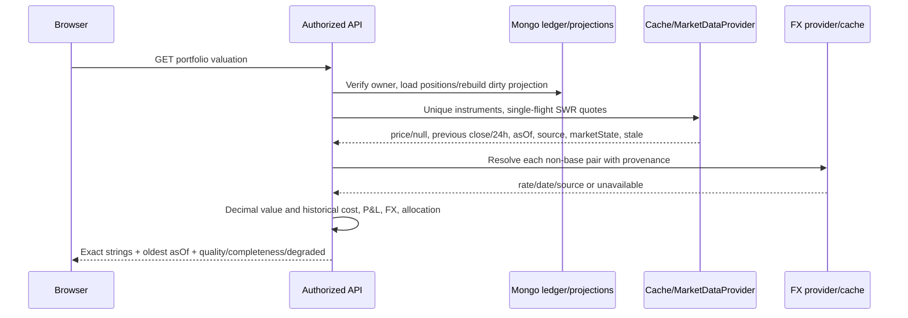
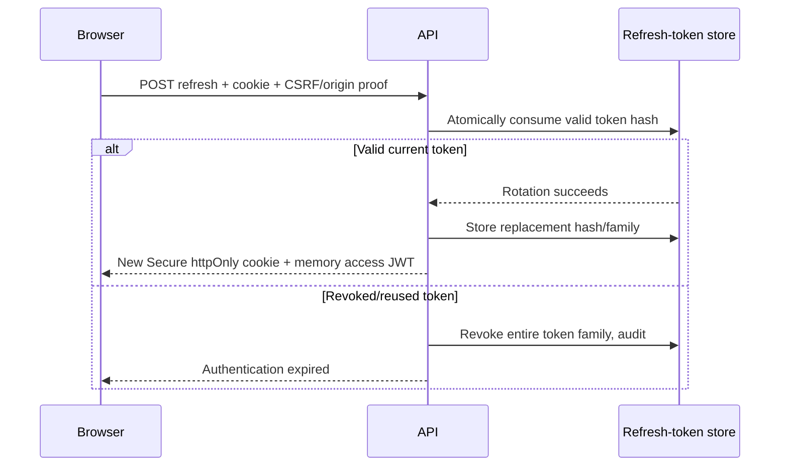
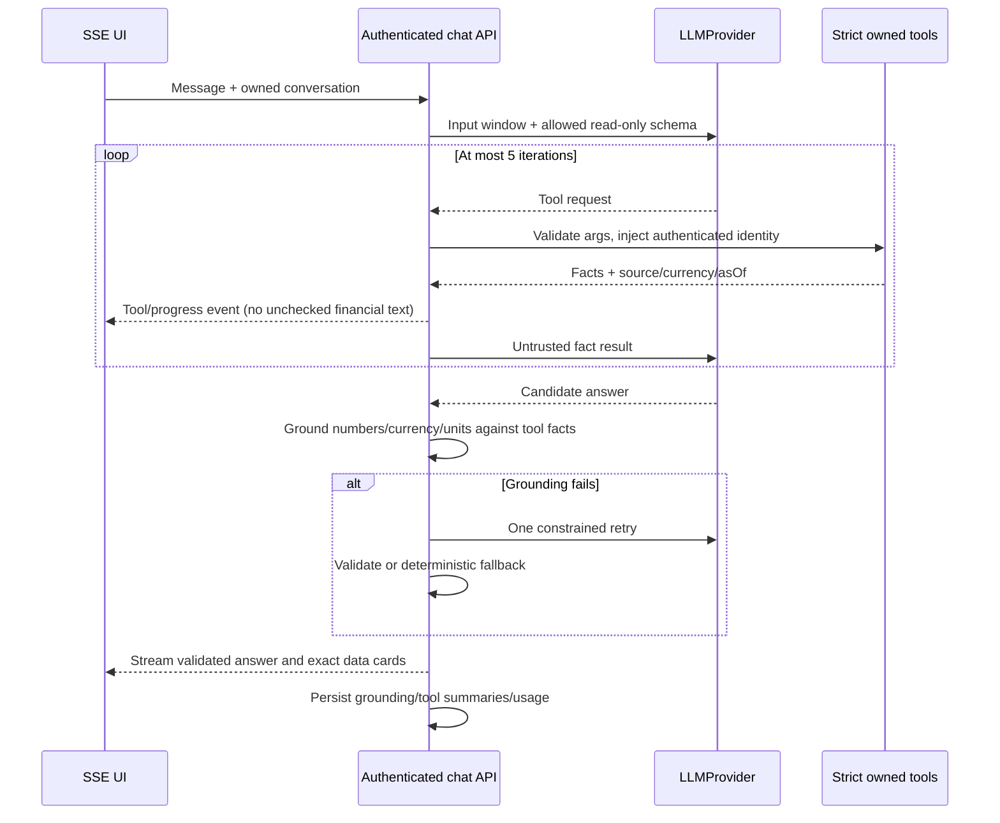

# Folio architecture and milestone plan

**Plan audited 2026-10-03; Phase 1/2 are CLOSED / APPROVED. Phase 3 explicitly authorized2026-10-04; inspection/planning started on codex/phase-3-domain from Phase2 closure5ad2baa.** Binding decisions are in [DECISIONS.md](DECISIONS.md); new [Phase3 plan](PHASE_3_PLAN.md) records build order, scope and pending choices. Existing architecture/foundation is preserved. Product/domain/deployment diagrams below remain plans until implemented/verified; no new financial engine or public deployment exists. Main remains Phase1. Historical phase authorization statements in dated material do not supersede the user's current authorization.

Phase3 inspection confirms required extension points: CacheStore currently supplies auth counters only; add typed market caching without weakening deployed Redis limits. Account export/deletion must include portfolios/ledger/voids/projections atomically, with writes serialized against deletion. Decimal inputs remain strings through lossless provider parsing and Decimal128 persistence; do not use the Yahoo wrapper's JSON-parsed financial numbers as calculation inputs. Public startup still rejects production until actual hosting/proxy/secrets/email/database/Redis/backup inputs are selected and verified. X03–X05 accounting/provider policy and O06 demo isolation remain proposals, not implemented architecture. Source/probe/regression evidence is in [Phase3 evidence](PHASE_3_EVIDENCE.md).

## Repository and module boundaries

The working directory had no application files, manifests or remote and only an empty pre-initialized Git repository. Reuse of that repository is the only bootstrap deviation from “git init”; no prior implementation was assumed. First commit contains only six documentation skeletons. Phase 0 adds documentation/evidence and .gitignore. Additional FRAME_INVENTORY/PROVIDER_AUDIT/PHASE_0_EVIDENCE docs keep the required handoff readable and preserve audit provenance; no alternate application layout is proposed.

Phase 1 implements §13's layout:

```text
apps/web                     React/Vite/strict TS
apps/api/src/
  config models routes controllers services jobs middleware providers ai utils
apps/api/tests/
packages/shared              strict Zod contracts + shared TS types/constants
packages/design-tokens       generated Figma variables/styles/geometry provenance
docs/                        architecture/ADRs/progress/demo/design handoff + audit evidence
scripts/                     seed/job runner/fixture tooling
docker-compose.yml           api + web + mongo + redis + mailhog
.github/workflows/ci.yml
.github/dependabot.yml
.env.example
README.md
```

React shared DS components live inside apps/web; no extra unrequested component package. UI uses TanStack Query for server state, Zustand for small local state, Router for release routes, RHF/Zod for forms, Recharts for server-produced numeric series. Financial strings must not be coerced to floats for calculations; plotting receives controlled display coordinates while exact values remain in tooltips/accessibility tables.

API controllers validate/authenticate/authorize then call domain services. Models never embed external provider logic. Shared schemas generate OpenAPI and response/error contracts; explicit nullable/unavailable/degraded states are part of schemas. Instrument IDs are canonical and server-verified, not user-typed provider tickers.

## System diagram

Phase 2 implemented boundary: users, refresh_families, refresh_tokens, auth_tokens and audit_logs are real Mongo collections with unique email/token hashes and TTL/indexes. Session rotation, replay revocation, password invalidation and deletion use replica-set transactions. Refresh families carry a serialization revision; users carry authVersion and actionTokenRevision. JWT checks include active family, verified user and authVersion, so revocation also invalidates previously issued access tokens. TTL cleanup never authorizes expiry.

JWTs expire in 15 minutes; families after 30 days absolute; verification after 24 hours and reset after 30 minutes. Redis atomic INCR/EXPIRE enforces 20 mutation requests/minute per IP/route and 10 auth email requests/minute per normalized account/route (120 read requests/minute); failures return 503. Five wrong credentials trigger progressive 30-second-to-15-minute lockout. MemoryCache exists only for explicit tests. The runtime always wires Redis. Deployment must use stable server keys and an explicit trusted-proxy/IP policy; current local HTTP uses an exact Origin/custom-header CSRF policy and a documented Secure-cookie exception.

Only /api/v1/me determines account ownership from verified bearer identity. Strict schemas reject injected owner/role/currency/query fields. JSON/CSV export includes owned public profile/audit data, excludes credentials and protects spreadsheet formulas. Deletion checks password plus DELETE confirmation and transactionally removes all five collections' owned data. The remaining deletion event contains no identity/IP/browser. Any future owned collection must extend both export and deletion before it ships. Audit expiry defaults to 90 days.

Frontend routes cover register, verify/resend, login, forgot/reset, expired session, privacy and account preferences/password/export/delete. TanStack Query owns in-memory account state; Zustand owns in-memory access credentials. Navigator Locks plus a single-flight promise serializes cookie rotation across tabs; no token enters browser storage. Explicit loading/error/invalid/expired/unverified/unavailable states reuse the approved DS. Portfolio defaults/onboarding, TOTP/session management and Google OAuth remain their original phases/tiers. Production EmailProvider selection O04 and HTTPS/Safari checks are deferred until authorized deployment; local MailHog is real SMTP.



Trust boundaries: browser inputs and AI/tool arguments are untrusted; authenticated user identity comes only from server middleware. Provider bodies/RSS snippets are untrusted data, never executable instructions. Outbound requests use a fixed allowlist, bounded body/redirect/timeouts; link rendering sanitizes text/URLs and never fetches arbitrary model-supplied URLs. Public article links do not authorize scraping/full text.

## Data model and index plan

All §6 collections are planned, activated only by tier. Economic money/quantity fields are Decimal128; API serialization is decimal string with presentation-only rounding. users default INR/timezone preference, canonical instrument native currency/exchange/sector/provider IDs, portfolios user-owned with many-capable schema and P0 one default.



FX_RATES, NEWS and JOB_RUNS are shared market/operational collections. Separate email verification/reset token storage (hash/TTL), ledger void events, projection version/dirty tracking and alert-kind/currency additions require documented schemas. D13 now assigns Watchlist P1, but its model/API remains unapproved; many-goal links await D11. Refresh token TTL is housekeeping, not expiry authorization.

| Collection / tier                       | Important proposed indexes and reason                                                                                                                                |
| --------------------------------------- | -------------------------------------------------------------------------------------------------------------------------------------------------------------------- |
| users / P0                              | unique normalized email; ensure lowercasing before writes                                                                                                            |
| refresh_tokens / P0                     | unique tokenHash; userId+familyId+revokedAt; expiresAt TTL; atomic rotation/reuse-family revocation                                                                  |
| portfolios / P0                         | userId+createdAt+_id; partial unique userId where isDefault=true                                                                                                     |
| instruments / P0                        | unique canonicalId; assetType+exchange+symbol; aliases/search indexes based on actual lookup plan                                                                    |
| transactions / P0                       | portfolioId+instrumentId+date+createdAt+_id deterministic replay; portfolioId+date+_id list; portfolioId+idempotencyKey unique partial nonempty; importBatchId in P1 |
| holdings / P0                           | unique portfolioId+instrumentId; portfolio-scoped sort/search indexes only where explain() justifies                                                                 |
| price_history / P0 history, expanded P1 | unique instrumentId+date; provenance/currency/adjustment policy stored with values                                                                                   |
| fx_rates / P0                           | unique pair+date; daily rate date/source provenance                                                                                                                  |
| portfolio_snapshots / P1                | unique portfolioId+date, revision/recompute marker; shared job only operates explicitly owned portfolio records                                                      |
| goals / P1                              | userId+targetDate+_id; portfolioId foreign-key index when supplied                                                                                                   |
| alerts / P1                             | userId+active+_id; instrumentId+active; extended kinds/currency need migration after D12                                                                             |
| news / P0                               | unique canonicalUrl; publishedAt+_id cursor; symbols+publishedAt; contentHash; text headline/snippet candidate subject to D09                                        |
| chat_conversations/messages / P0        | userId+createdAt+_id; conversationId+createdAt+_id; ownership checked on both conversation and message                                                               |
| pending_actions / P1                    | userId+status+expiresAt; expiresAt TTL; confirm is atomic and 10-minute expiry enforced in code                                                                      |
| notifications / P1                      | userId+dedupeKey unique; userId+read+createdAt+_id                                                                                                                   |
| audit_logs / P0                         | userId+at; action+at; redacted meta, approved retention policy                                                                                                       |
| job_runs / P0 jobs                      | name+startedAt; job idempotency/checkpoint keys to prevent duplicate work                                                                                            |

Every foreign key/query path will be evaluated with explain() and realistic data; do not create every hypothetical compound combination against a 0.5GB free database. Owner checks are not replaced by indexes.

## Ledger and valuation flow

Financial arithmetic remains decimal from input → upstream parsing → storage → calculation → API. Preserve JSON numeric tokens from providers (lossless-json candidate) before converting to Decimal; JSON.parse number conversion cannot be repaired later by String(number).

Transaction creation: authenticate and verify portfolio → resolve canonical instrument → strict type-specific validation, supported native currency/FX/date precision → idempotency key → lock/version and atomic append/projection update → replay all entries including backdated transactions to ensure no negative units at any date → invalidate snapshots from effective date → return server valuation. Concurrent sells cannot independently spend the same units; local/test Mongo replica set supports transactions.

X03 proposal: immutable economic entries; append-only void events with reason/actor/time; API void metadata derived or maintained only in projection. Repeated void is idempotent; replacements are new entries. SPLIT needs explicit ratio numerator/denominator; units/cost adjust without realizing P&L. Dividend is cash income, not reinvested. FIFO lots preserve historical FX and fees. Displayed average local cost is remaining cost divided by remaining units, not total cost.



valueLocal = units×price; valueBase = valueLocal×currentFx; costBase sums remaining lot purchase costs using each stored historical FX including fees. Server computes local/base returns, realized FIFO P&L, income and daily change. FX return difference is percentage points with named denominator; any absolute FX component needs approved multiple-lot convention (X04), not ad hoc currency subtraction.

Missing uncached price returns null/unavailable, never cost/zero. X04 proposes known subtotal plus coverage and unavailable derived ratios; stale usable quotes retain source/date and degraded=true. Top-level asOf is oldest used input, including disclosed FX date. Equities open/closed freshness uses versioned exchange calendars/exceptional sessions; crypto 24×7/rolling 24h. Frankfurter daily-reference FX cannot claim realtime.

P0 allocation is class/instrument/sector/currency plus configurable concentration flags (sector >40%, instrument >25%). Unknown metadata has an explicit category. P1 historical snapshots/TWR/XIRR use approved cash-flow/benchmark convention; backdates/voids recompute affected dates. CAGR needs valid span; XIRR must explain non-convergence/insufficient flows. Risk/attribution metrics remain P2 and methodology-gated.

## Auth and threat model

Access JWT stays memory-only, 15-minute expiry. httpOnly Secure refresh cookie scoped to same-origin API; hashed refresh secrets with family tracking, rotation, device metadata and reuse revocation. No localStorage token. Argon2id candidate; password reset/verify tokens hashed/expiring/single-use. Refresh, logout and state-changing cookie-backed routes enforce CSRF and origin policy.



| Threat                                                | Planned control and meaningful verification                                                                                        |
| ----------------------------------------------------- | ---------------------------------------------------------------------------------------------------------------------------------- |
| IDOR via nested resource IDs, AI arguments or imports | Server user injection + owner checks for every resource; two-user read/mutate tests on every endpoint                              |
| Refresh replay/race and reset token replay            | Atomic rotation/family revocation; concurrent refresh tests, replay tests, CSRF tests                                              |
| Oversell/backdated ledger divergence                  | Transaction/version concurrency + deterministic full replay; property tests compare incremental/full rebuild; concurrent sell test |
| Prompt injection/ungrounded numbers                   | Untrusted provider text framing, strict allowlisted tools, owner scope, validation/retry/fallback, adversarial eval suite          |
| SSRF/unsafe news links                                | Fixed outbound hosts, timeout/size/redirect policy, safe text/url rendering; arbitrary URL rejection tests                         |
| CSV formula injection/idempotent import               | Format-aware normalization; formula-safe export; row-level errors and duplicate/undo fixtures (P1)                                 |
| Leaked tokens/secrets/2FA                             | Ignored env + host secret manager, redacted pino, encryption key of 32 bytes, hash backup codes; gitleaks in CI                    |
| Rate-limit bypass under multiple instances            | Redis-backed deployed limiter; restart/multi-instance tests; in-memory only tests/dev                                              |
| Cross-origin cookie loss                              | Same-origin frontend proxy; Chrome + real Safari deployment persistence and SSE smoke                                              |
| Demo/production cross-contamination                   | Explicit DEMO_MODE/user isolation, deterministic domain-engine fixtures and visible banner, tests with network disabled            |

Strict CSP permits self-hosted fonts and safe script/connect targets. Account export/delete requires ownership and correct collection cascade/revocation. Audit logs must not contain passwords, tokens or raw provider credentials. No production secret value is in Phase 0 evidence.

## AI tool-call flow and streaming discrepancy



This diagram's safe streaming order is **confirmed by the user's X06 approval on 2026-10-04**: progress/tool activity can stream, but financial answer content is buffered until validation; only validated numbers reach the user. Numerical tolerance/percentage/date/currency rules must be explicit and fixture-tested; not every numeral in prose is a financial claim. No tool accepts model userId, changes data in P0 or bypasses ownership. P1 write behavior remains pending its phase decisions.

P1 propose tools create pending_actions (expiry 10 minutes). Confirm endpoint validates authenticated owner, status/expiry and current domain rules atomically; rejection/expiry/replay cannot execute. Write-through only via domain services/idempotency, never direct model DB mutations. Tool cards include actual arguments/result summaries with redaction, not guessed “grounding” labels.

## Jobs, providers and deployment

JobRunner supports local BullMQ+Redis and stateless HMAC HTTP/CLI. Every job is bounded/idempotent with lock/checkpoint and job_runs evidence; verify shared-secret signature, replay window and fixed allowlist of job names. Free cloud API can sleep, so durable external scheduler triggers ingestion/refresh/backfill; schedules can delay and stale data remains visible.

CacheStore has Redis deployment and in-memory test/dev; SWR, single-flight, per-provider breaker/backoff and bounded retries. Cache keys include canonical instrument/provider/range/currency and policy version. Circuit breakers do not fabricate fallback prices. Global crypto batches use monthly reserve accounting; old history and fallback entitlements are unresolved O03/X05.

Deployment candidates and limits are in [PROVIDER_AUDIT.md](PROVIDER_AUDIT.md). Frontend/API/Mongo/Redis/email credentials are needed by first deployment after Phase 3. All required Dockerfiles/host configs will be produced even if deployment credentials are pending. A same-origin /api rewrite is required when hosts use separate registrable domains; never use an external redirect that reintroduces third-party cookies. Redis mandatory for deployed limits; read-only health vs ready distinguishes liveness/dependencies.

The Phase 1 CI workflow is configured to run frozen install, lint, strict typecheck, tests/coverage, builds, dependency audit, gitleaks and screenshot checks for shipped UI, with Dependabot. Manual deployment approval gate applies. The canonical remote is ambaragrawal33/folio. Phase 1 hosted CI run 37178104505 succeeded; Phase 2 hosted results are separately recorded in its evidence.

## Milestones, risks and inputs

Every phase ends with evidence, PROGRESS update and STOP. Every shipped UI needs live MCP reinspection, both-theme desktop fidelity and logged derived/responsive/state review. Finish/deploy P0 (Phases 1–5) before Phase 6 P1.

| Phase                     | Deliverables                                                                                                                                                                   | Main risks / decisions                                                                                                   | Inputs needed                                                                                         | Exit evidence                                                                                                            |
| ------------------------- | ------------------------------------------------------------------------------------------------------------------------------------------------------------------------------ | ------------------------------------------------------------------------------------------------------------------------ | ----------------------------------------------------------------------------------------------------- | ------------------------------------------------------------------------------------------------------------------------ |
| 0 — audit                 | Toolchain/repo/Figma inventory, DS/tokens/contrast/gaps, providers/dependencies, plans                                                                                         | Toolchain and required P0 decisions resolved; later-phase risks remain deferred                                          | Required decisions supplied; Docker/Compose daemon verified 2026-10-04                                | APPROVED by user 2026-10-04; Phase 1 explicitly authorized                                                               |
| 1 — foundation            | Exact monorepo, strict shared contracts, env validation, Mongo/Redis, logs/error envelope, health/ready, Compose, CI/OpenAPI; generated tokens/fonts, shell/primitives/gallery | TS6.0.3 pinned with verified peers; native binaries/ESM checked; derived Light/responsive references await design review | Docker/Compose; approved pins/DS policy; user-supplied Git remote required for hosted CI              | Clean-clone stack up, CI when remote exists, lint/typecheck/build, both-theme gallery/shell fidelity                     |
| 2 — auth                  | Full register/verify/resend/login/rotation/reuse/logout/reset/change password, CSRF/rate limits/audit, profile/privacy and auth UI                                             | Missing Figma flows; refresh races; third-party cookies avoided                                                          | Prod email choice before live auth; development MailHog no key                                        | Auth+IDOR scaffolding, Playwright register→verify→login; expiry/replay tests; fidelity                                   |
| 3 — domain + first deploy | Instrument master/search/provider cache/fallbacks, ledger/projection/void, valuation, holdings/detail/transactions/dashboard, P0 settings/onboarding, seed/DEMO                | Free history/FX calendar gaps, oversell/concurrency/splits, price-null/FX/day semantics, corrected misleading labels     | CoinGecko Demo key; fallback key if chosen; hosts/Atlas/Redis/domain/SMTP/job secret; data rights/use | Financial fixtures/property/concurrency/IDOR; app public and smoke, demo with providers disabled; manual deploy approval |
| 4 — news                  | Permitted RSS metadata ingestion, dedupe/tagging, For You/Market/Portfolio/search, detail/outbound attribution/freshness                                                       | Reachability ≠ license; relevance false positives; no full text; source failure isolation                                | Approved source rights/use; scheduler; paid NewsAPI only if explicitly selected                       | Live headlines/source failure test, tags/search fixtures, deployed feed, fidelity                                        |
| 5 — AI P0                 | Provider/tool loop, injection defenses, numeric grounding/retry/fallback, safe SSE UI/cards/evals                                                                              | Pre-validation streaming conflict; tool ownership; model availability/limits                                             | Selected LLM/model/key/spend/privacy policy                                                           | CI evals incl cross-user injection, deterministic fallback, live model smoke/fidelity; **all P0 deployed before P1**     |
| 6 — P1 analytics          | Snapshots/backfill/TWR/XIRR/CAGR/benchmark/historical views, Dashboard history                                                                                                 | Flow/dividend/cash conventions; corporate actions/adjusted history; sparse coverage/recomputation                        | History coverage/benchmark convention; actual reference spreadsheet fixture                           | Hand fixtures including 365/366-day XIRR and multi-flow reference, backdated rebuild, deployed charts/fidelity           |
| 7 — P1 planning           | Multi-portfolio, goals/simulator, CSV preview/idempotency/import undo/export, price/approved-kind alerts/notifications/anomalies; Watchlist only if assigned here              | D11/D12/D13 models/methods; target currency; current broker CSV formats                                                  | Permitted real CSV samples, goal/alert/watchlist decisions; job plan                                  | Crossing/dedupe/import tests, owner tests, simulator fixtures, deploy/fidelity                                           |
| 8 — P1 depth              | Sentiment, propose/confirm, MF/metals/manual, TOTP/sessions, security pass                                                                                                     | Sentiment text prompt injection, quotes/NAV/units, expired confirm, 2FA recovery                                         | AMFI/schema/metal-unit decisions, confirm UX; any selected sentiment service key                      | Threat model reviewed, all P1 IDOR, confirm replay/expiry, NAV/CSV fixtures, deploy/fidelity                             |
| 9 — polish/release        | Full E2E/accessibility/fidelity, 500-transaction performance, clean-clone docs, complete demo, final approved deploy                                                           | Coverage/real Safari limitations, free quotas/cold starts, incomplete reviews                                            | Release/deploy approval, Safari access, accounts/backup procedure                                     | All §16 gates, measured performance, Chrome/Safari smoke, walkthrough; only then approved P2                             |
| P2 — future               | Selected risk/tax/digest/push/OAuth/admin/PWA/corporate-action UI polish                                                                                                       | No approved methods/tax rules/OAuth sender/service accounts yet                                                          | Explicit scope and method approvals with current docs/credentials                                     | Separate plan/phase branches and gates; **not begun**                                                                    |

## Verification plan (not execution claims)

Financial tests ≥90% lines: Decimal precision (18 quantity/10 price), fees, FIFO partial sells, splits/dividends, historic FX vs current FX; deterministic replay/property tests; missing/stale quotes. XIRR one year -1000/+1100 actual/365 =10%; leap-year 366 days ≈9.97%; multi-flow reference spreadsheet expected values; TWR external-flow logic; no duplicate CSV/import; confirmation numeric grounding.

Overall ≥70%, IDOR every resource endpoint, auth race/reuse/CSRF/rate limit, provider recorded fixtures without live network, failure/circuit/SWR/single-flight tests, Playwright real user path and own approved both-theme screen/state baselines. Core security/performance checks cannot be deferred just to ship a phase.

500-transaction performance and release-level clean-clone timing require Phase 9 measurements. Phase 1 verifies its foundation using actual local gates and an isolated clean checkout; see [Phase 1 evidence](PHASE_1_EVIDENCE.md). Phase 1 hosted CI and its user-approved visual foundation are confirmed. Phase 2 reuses those immutable screenshot baselines. No public URL or implemented financial-core coverage is asserted.
