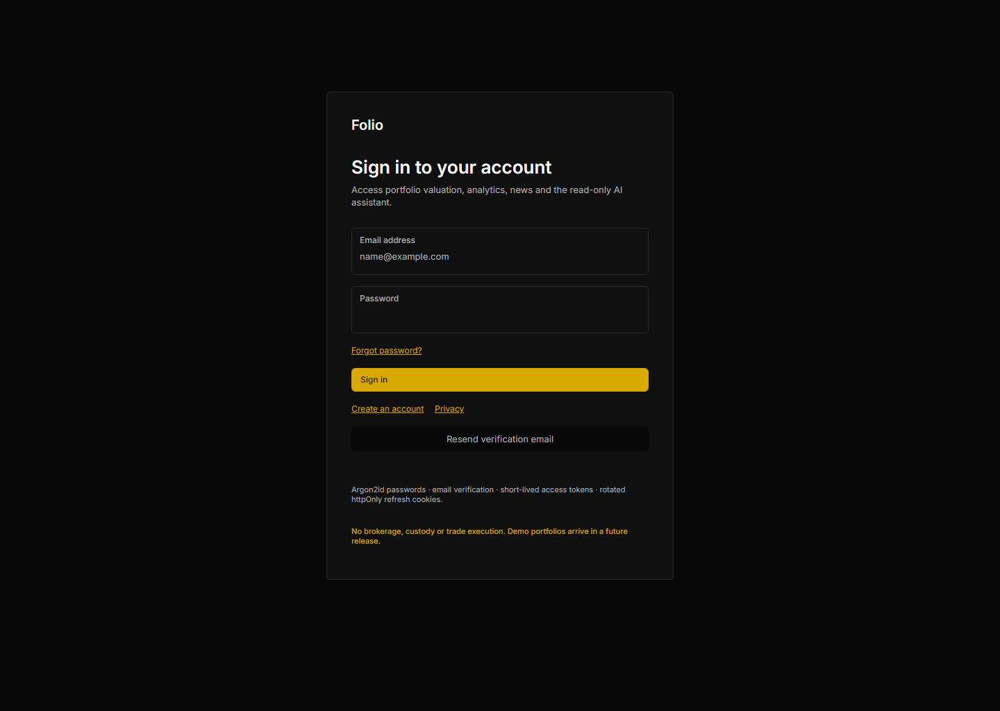
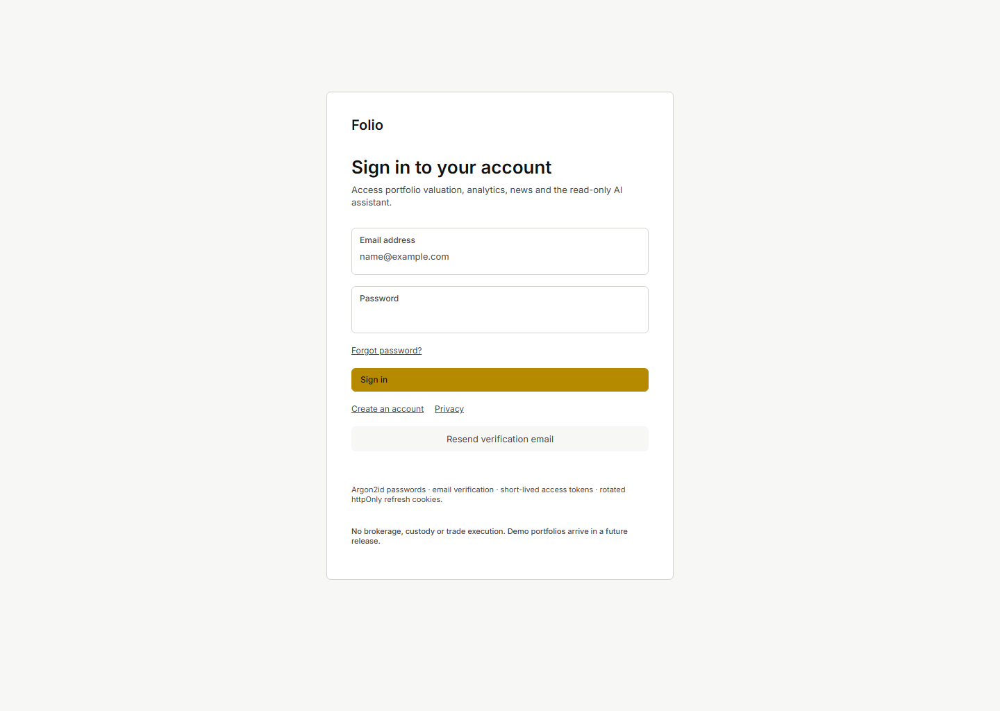
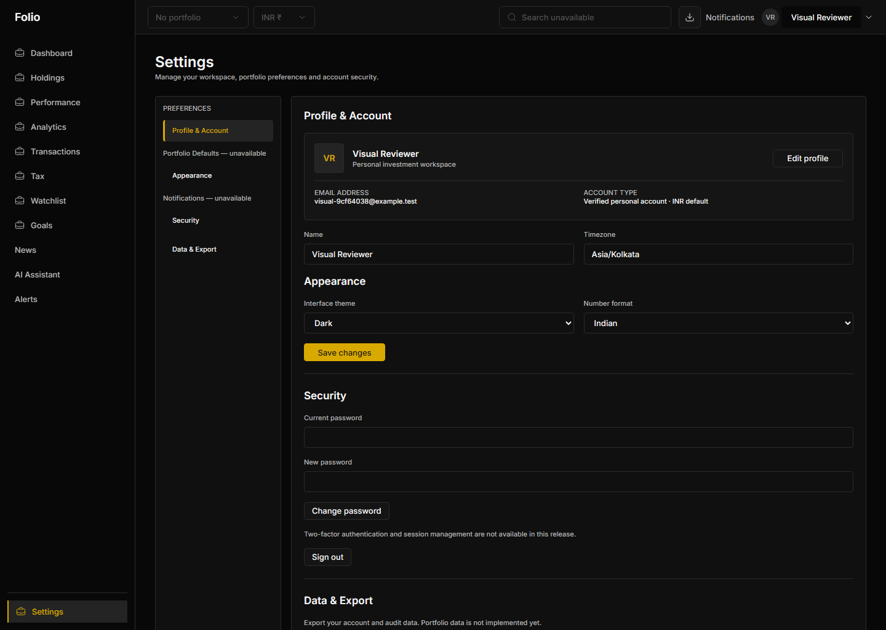
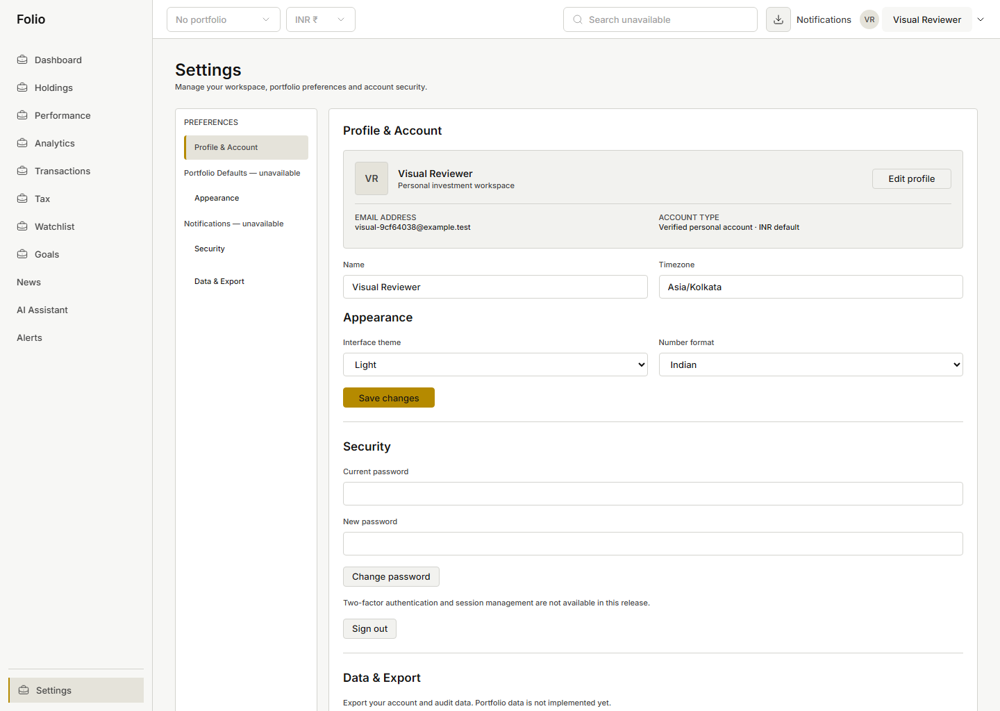
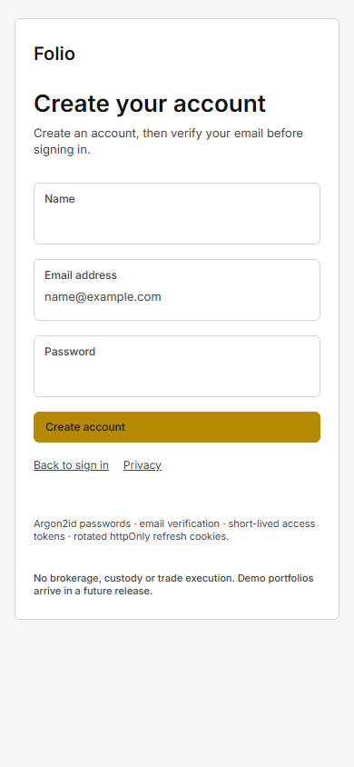
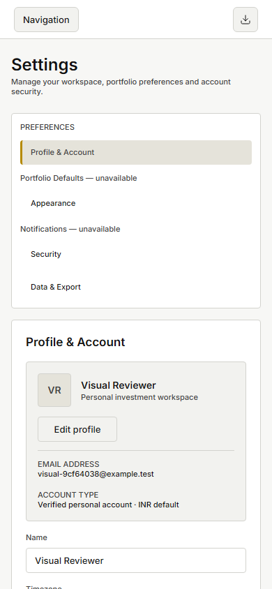

# Phase 2 visual corrections — awaiting visual approval

The user requested five targeted corrections after declining visual approval. Engineering remains provisionally accepted; these captures are candidates for review, not approved regression baselines. Phase 1 foundation/captures and Figma are unchanged. Phase 3 has not started.

## Changed components and corrections

| File / component                                                           | Change                                                                                                                                                                                                                   |
| -------------------------------------------------------------------------- | ------------------------------------------------------------------------------------------------------------------------------------------------------------------------------------------------------------------------ |
| apps/web/src/auth/Account.tsx — AccountForms                               | Settings-only title class; accessible full-name text/title; nested forms use borderless settings-form; human-readable deletion field copy; traced Save width.                                                            |
| apps/web/src/auth/AuthScreens.tsx — AuthScreens                            | Pending submissions select existing Disabled variant and aria-busy; active appearance/geometry unchanged.                                                                                                                |
| packages/design-tokens/source/auth-geometry.json                           | Added exact live Settings54:50 source geometry/type roles and provenance to the Phase 2 extension.                                                                                                                       |
| packages/design-tokens/source/auth.css.template                            | Settings-scoped source typography,29px desktop actions/34px fields/4px corners/3px marker/142px profile; avatar outline; one boundary per section; desktop grid/mobile Edit second row; one-line intrinsic action width. |
| packages/design-tokens/generated/auth.css                                  | Re-generated extension; canonical tokens/components/responsive CSS untouched.                                                                                                                                            |
| apps/web/src/auth/auth.test.tsx                                            | Pending disabled-state behavior and deletion copy/case-sensitive confirmation/no DELETE before valid confirmation.                                                                                                       |
| apps/web/e2e/auth.spec.ts                                                  | Desktop source geometry and mobile identity width/Edit placement/readability regressions; deletion copy; optional evidence directory preserves historical captures.                                                      |
| docs/DESIGN_HANDOFF.md, DECISIONS.md, PROGRESS.md                          | Source audit, decisions, retained deviations, verification and pending visual status.                                                                                                                                    |
| docs/PHASE_2_VISUAL_CORRECTIONS.md and evidence/phase-2/visual-corrections | This review pack, exact outputs, source context, measurements, capture script and screenshots.                                                                                                                           |

Mobile Settings identity grew from approximately30px to **220px**; profile height fell from359px to **229px**. The avatar/identity share the first row; Edit follows below. Both identity lines fit naturally without smaller text. Desktop profile is142px high; title24px, section17px, Edit114×29, Save132×29, corners4px, selected row35px/marker3px and avatar1px outline were measured.

Deletion errors now say **“Enter your current password to delete your account.”** and **“Type DELETE exactly to confirm account deletion.”** They were checked in Dark/Light desktop and Light390px mobile. Permanent deletion is one line at the existing13px compact role, with intrinsic200px width, within the mobile container. Cancel and password+exact-uppercase confirmation remain required.

Login pending now maps to live DS **2:4804**: base surface, default border, disabled text; native disabled plus aria-busy and existing progress wording. No source loading/spinner variant exists. Both-theme pending captures confirm the change without editing the shared Button.

## Source and retained differences

The supplied production specification and current living architecture/provider documents were read before this scoped correction. No dependency/provider, domain or backend contract change was needed.

Connected Figma `get_design_context` was read-only for **54:50** and **2:4804**, including screenshots; structured context is retained in [figma-contexts.json](evidence/phase-2/visual-corrections/figma-contexts.json). Settings references include title54:517, section54:532, profile/avatar54:535/536, action54:540, field54:550, marker54:523/524 and Save54:595. No new static asset was required; original shell assets remain unchanged.

Exact remaining differences and reasons are recorded in [DESIGN_HANDOFF.md](DESIGN_HANDOFF.md): readable13px action/11px label roles;17px working-form group headings;36px mobile targets; approved fluid grid/padding; DS Primary save; native persisted preferences without System; extra P0 forms/normal-flow height; approved accessible semantic aliases. Light and mobile are **derived implementations**, not Figma-approved. They remain pending visual approval.

## Updated six-state review

Captures use the actual running local app and a real disposable verified account, with preferences saved through the API and checked after reload. No authentication response was mocked. Pending Login was captured by holding then releasing a real request. The review-created account was deleted afterward through the real API.

### Dark Login — 1440×1024

[Updated Disabled pending state](evidence/phase-2/visual-corrections/login-dark-loading.png) · [focus](evidence/phase-2/visual-corrections/login-dark-focus.png) · [validation](evidence/phase-2/visual-corrections/login-dark-validation.png)

### Light Login — 1440×1024 — derived

[Updated Disabled pending state](evidence/phase-2/visual-corrections/login-light-loading.png) · [focus](evidence/phase-2/visual-corrections/login-light-focus.png) · [validation](evidence/phase-2/visual-corrections/login-light-validation.png)

### Dark Settings — 1440×1024

[Full page](evidence/phase-2/visual-corrections/settings-dark-full.png) · [human-readable deletion validation](evidence/phase-2/visual-corrections/settings-dark-delete-validation.png)

### Light Settings — 1440×1024 — derived

[Full page](evidence/phase-2/visual-corrections/settings-light-full.png) · [human-readable deletion validation](evidence/phase-2/visual-corrections/settings-light-delete-validation.png)

### Light mobile Registration — 390×844 — derived

Registration composition was not redesigned; regression capture confirms the existing foundation. [Validation](evidence/phase-2/visual-corrections/register-mobile-light-validation.png).

### Light mobile Settings — 390×844 — derived

[Full page](evidence/phase-2/visual-corrections/settings-mobile-light-full.png) · [unchanged open navigation](evidence/phase-2/visual-corrections/settings-mobile-light-navigation-open.png) · [confirmation](evidence/phase-2/visual-corrections/settings-mobile-light-delete-confirmation.png) · [human-readable validation/one-line action](evidence/phase-2/visual-corrections/settings-mobile-light-delete-validation.png)

## Executed verification

| Command/check                                                                                                  | Actual result / output                                                                                                                                                                                                                                                                                                                                                                                        |
| -------------------------------------------------------------------------------------------------------------- | ------------------------------------------------------------------------------------------------------------------------------------------------------------------------------------------------------------------------------------------------------------------------------------------------------------------------------------------------------------------------------------------------------------- |
| pnpm check                                                                                                     | Lint/format/token freshness/strict typecheck,58 tests/6 suites,coverage/build PASS. [Output](evidence/phase-2/visual-corrections/quality-gates.txt). Initial run caught an unsupported option in the new test query; corrected before this final passing run.                                                                                                                                                 |
| FOLIO_E2E_STACK=1 FOLIO_E2E_EVIDENCE_DIR=.local/phase-2-corrections-e2e pnpm test:e2e                          | All6 tests PASS in39.9s, including unchanged Phase 1 gallery/shell/mobile screenshot comparisons. [Output](evidence/phase-2/visual-corrections/browser-tests.txt).                                                                                                                                                                                                                                            |
| PLAYWRIGHT_BROWSERS_PATH=C:/Users/ambar/AppData/Local/ms-playwright node .local/phase-2-visual-corrections.mjs | Six exact-viewport captures;12 default/pending/confirmation/open-menu axe audits with0 violations; geometry/readability/copy/one-line action/focus/menu/real-account cleanup PASS. [Output](evidence/phase-2/visual-corrections/visual-checks.txt), [measurements](evidence/phase-2/visual-corrections/measurements.json), [executed capture script](evidence/phase-2/visual-corrections/capture-script.txt). |
| PNG-header dimensions                                                                                          | Four1440×1024 and two390×844; viewport captures are not full-page substitutes. Supplementary full pages are separately named.                                                                                                                                                                                                                                                                                 |
| pnpm deps:verify; pnpm audit --audit-level=moderate                                                            | 459 packages/73 peer edges,0 failures; no known vulnerabilities. Dependency files/lockfile unchanged.                                                                                                                                                                                                                                                                                                         |
| node scripts/scan-secrets.mjs                                                                                  | Trackable working files and full existing history PASS with unchanged gitleaks policy. [Output](evidence/phase-2/visual-corrections/secret-scan.txt).                                                                                                                                                                                                                                                         |
| docker compose ps                                                                                              | API/web/Mongo/Redis healthy; MailHog running, loopback exposure. [Output](evidence/phase-2/visual-corrections/compose-health.txt).                                                                                                                                                                                                                                                                            |
| git diff --check; unchanged-foundation comparison                                                              | No whitespace errors; no changes to approved Phase 1 captures, canonical tokens/components/responsive CSS, source geometry, styles or foundation primitives. [Output](evidence/phase-2/visual-corrections/foundation-boundary.txt).                                                                                                                                                                           |

Coverage: lines93.94%, statements92.68%, functions92.07%, branches89.10%; all existing70% gates pass. Financial-core90% gate is configured and N/A because no financial engine is changed/implemented.

Every measured state has scrollWidth equal to viewport width and0 independent scrolling containers. Mobile menu opens at y56 in normal flow with overflow visible, no modal/backdrop; Settings remains selected; Escape resets aria-expanded and route changes collapse it. Edit focuses Name; subsequent tabs reach Timezone, Theme, Number format. Auth and deletion field errors focus the first invalid input. Default/login pending/three deletion-validation/menu states passed axe; these bounded checks do not replace visual approval.

Captures were generated from the corrected working tree based on34c38b4ddba254f85e72206d213a2aeac8309507; measurements record that pre-commit base HEAD. The correction's final commit/remote/tree status is reported after committing. No force push, main merge, Figma modification, foundation redesign or Phase 3 work is authorized/performed by this correction.
